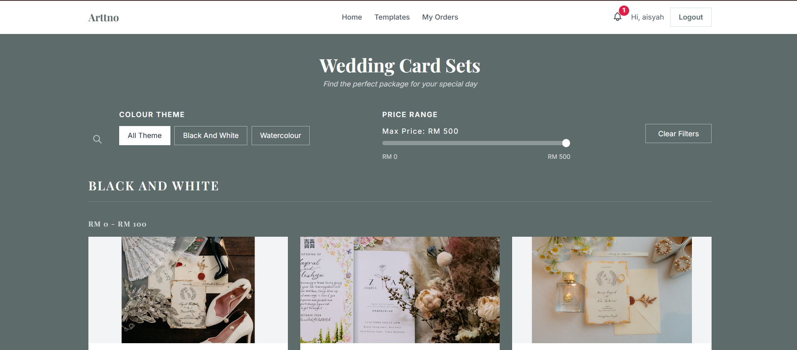
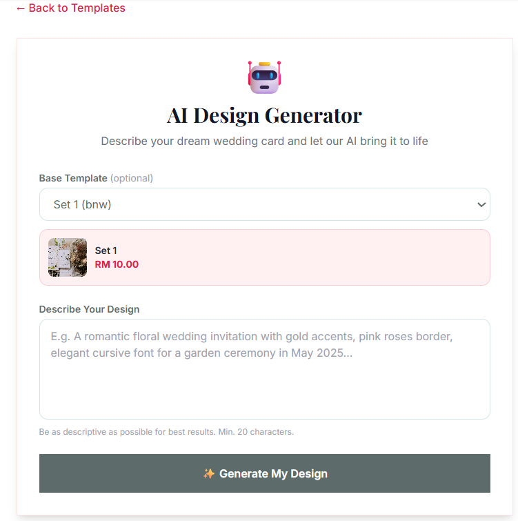
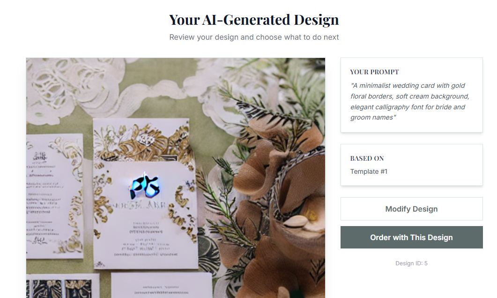
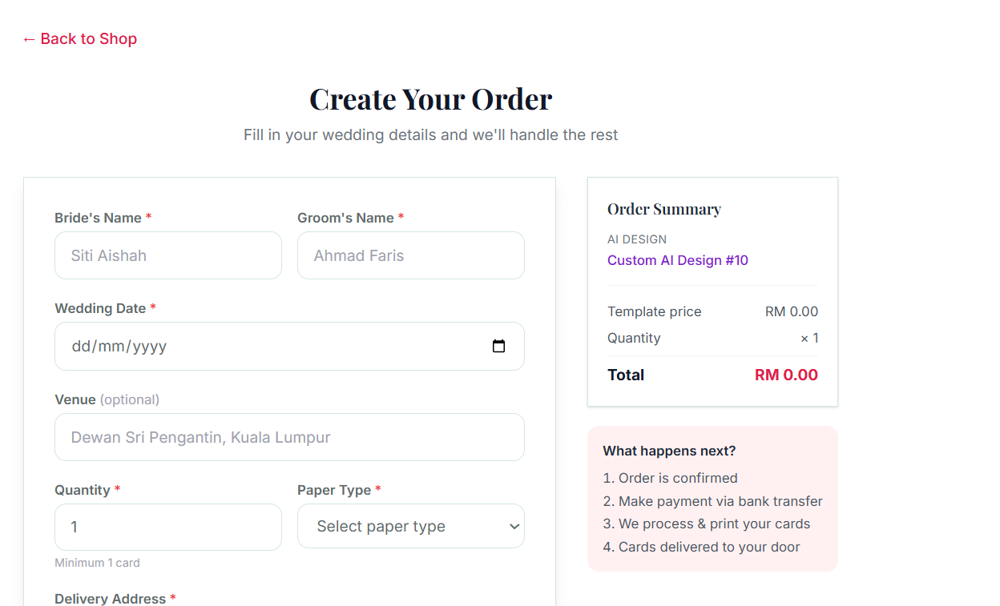
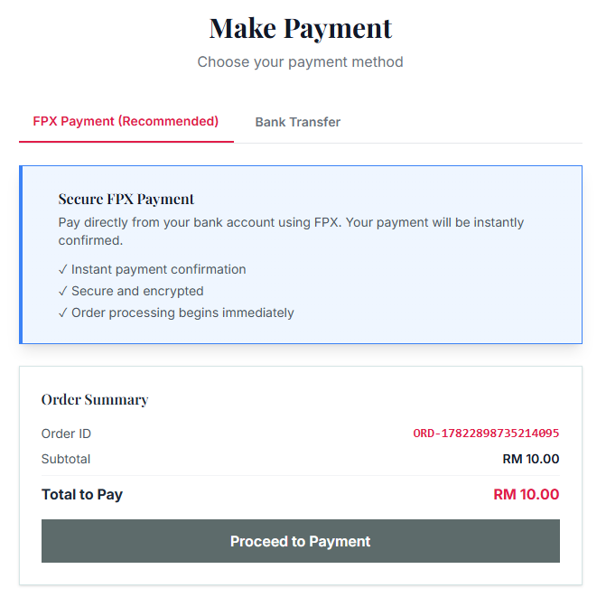
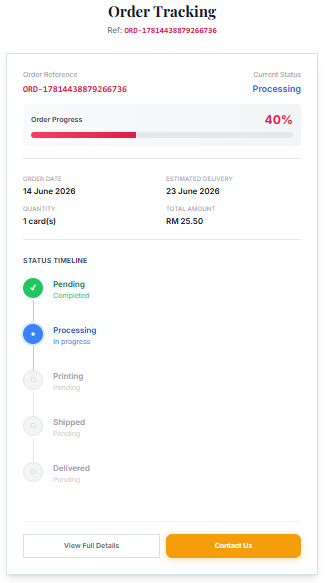

<!-- ═══════════════════ HERO ═══════════════════ -->

  

### 💍 Full-stack wedding card e-commerce with AI-powered design generation
**Live in production · Serving real customers · Built end-to-end by one engineer**

 

 

  

<!-- Hero image — clicking it opens the full video demo -->

 

🎬 **[Watch the full 3-minute demo on YouTube](https://youtu.be/3d6BjJUqbvA)**

 

🔗 **[Visit the live platform](https://arttno.me)** &nbsp;·&nbsp; 📬 [Contact me](mailto:nurfarah.dev@gmail.com)

---

## 🌿 Overview

**Arttno** is a production e-commerce platform where couples browse wedding card templates, generate unique designs with AI, place orders, and pay online — replacing the traditional manual process of visiting printing shops and coordinating over messages. Built solo, end-to-end across five modules: **Authentication, Template Management, AI Design Interaction, Order Management, and Payment**.

> **Note on source code** 🔒
> The source is private as this platform serves real customers and handles live payment data. I'm happy to walk through the codebase, architecture decisions, and any part of the implementation in an interview.

---

## ✨ Key Features

### 🎨 AI Design Generation Pipeline
Arttno's key innovation — customers can generate unique card designs instead of only picking templates:

1. The customer describes their dream card and optionally selects a base template
2. The backend loads the template image and sends it with the prompt to a dedicated **Cloudflare Worker** (deployed independently via Wrangler CLI)
3. **LLaMA 3.2 Vision** analyzes the template's colors and style, and a **prompt-enhancement layer** builds an optimized generation prompt from the analysis + customer input
4. **Flux Schnell** generates brand-new designs from text, while **Stable Diffusion v1.5 (img2img)** handles template-based modifications
5. Customers can **iteratively refine** their design — the modify flow shows a before/after comparison and re-invokes the Worker with new instructions

  
  
   <i>Left: the customer describes their design &nbsp;·&nbsp; Right: the AI-generated result, ready to order or modify</i>

### 🛒 Order Creation with Dynamic Pricing
Placing an order captures the couple's wedding details and computes pricing server-side:

- Base price pulled from the selected template/set, plus a **paper-type surcharge** (standard / premium / luxury)
- **Estimated delivery auto-calculated** as 7 working days from order date, excluding weekends
- A unique order reference is generated and persisted with the order

  
   <i>Order form capturing wedding details, with live order summary and pricing</i>

### 💳 Dual Payment Methods with Verified Webhooks
Two payment paths, both production-tested:

- **ToyyibPay (FPX online banking)** — the backend creates a bill via the ToyyibPay API, redirects the customer to the gateway, and receives a **webhook callback** on completion. **HMAC-based signature verification** authenticates every incoming webhook before payment and order status are updated — no manual verification, no trusting the client
- **Manual bank transfer** — customers upload a receipt, which admins review and confirm from the admin panel

  
  
   <i>Left: payment method selection with order summary &nbsp;·&nbsp; Right: the ToyyibPay FPX gateway (sandbox)</i>

### 📦 Five-Stage Order Tracking
Orders progress through **Pending → Processing → Printing → Shipped → Delivered**:

- Customers track live status and progress on a visual timeline
- Admins advance the status through the fulfilment workflow; the customer is **notified on every status change**
- Customers can **self-service cancel** eligible orders

  
   <i>Customer order tracking — progress bar and five-stage status timeline</i>

### 📊 Admin Dashboard & Management
- Revenue trends, customer growth, and payment-method breakdown charts
- Pending-action alerts for orders and payments awaiting review
- Template management with **Multer-based image uploads**, order status management, and manual-transfer confirmation

  
   <i>Admin dashboard — revenue trend, payment method breakdown, customer growth & pending-action alerts</i>

---

## 🏗️ Architecture

**Stack rationale:**

| Layer | Technology | Why |
|-------|-----------|-----|
| Frontend | Vue.js 3 (Composition API) | Reactive customer storefront + admin dashboard |
| Backend | Node.js + Express.js (MVC) | REST API with JWT auth, rate limiting & CORS middleware |
| Database | MySQL | Relational schema: User, Customer, Admin, Template, AIDesign, Order, Payment, Message, Notification |
| AI | Cloudflare Workers AI | Serverless edge: LLaMA 3.2 Vision · Flux Schnell · Stable Diffusion v1.5 img2img |
| Payments | ToyyibPay | Malaysian FPX online banking with HMAC-verified webhooks |
| Deployment | DigitalOcean · Nginx · PM2 · Let's Encrypt | Reverse proxy, process management, auto-renewing SSL |

---

## 🔧 Engineering Highlights

- **HMAC webhook verification** — payment success is only trusted after the ToyyibPay callback's signature is verified server-side; the client is never the source of truth
- **Separated AI compute** — image generation runs on an independently-deployed Cloudflare Worker at the edge, keeping heavy AI workloads off the application server and behind a single configurable endpoint
- **Vision-guided prompt building** — customer input is never sent raw to the image model; LLaMA 3.2 Vision's template analysis is merged into an enhanced prompt for consistent, print-appropriate results
- **Stateless auth & hardening** — JWT authentication, bcrypt password hashing, and rate-limiting middleware on the API
- **Notification-driven fulfilment** — every order status transition notifies the customer, eliminating "where is my order?" support load

---

  Built with 🤍 by <a href="https://github.com/farahyusni">Nurfarah Izzati</a> · Full-Stack Software Engineer
    
  

