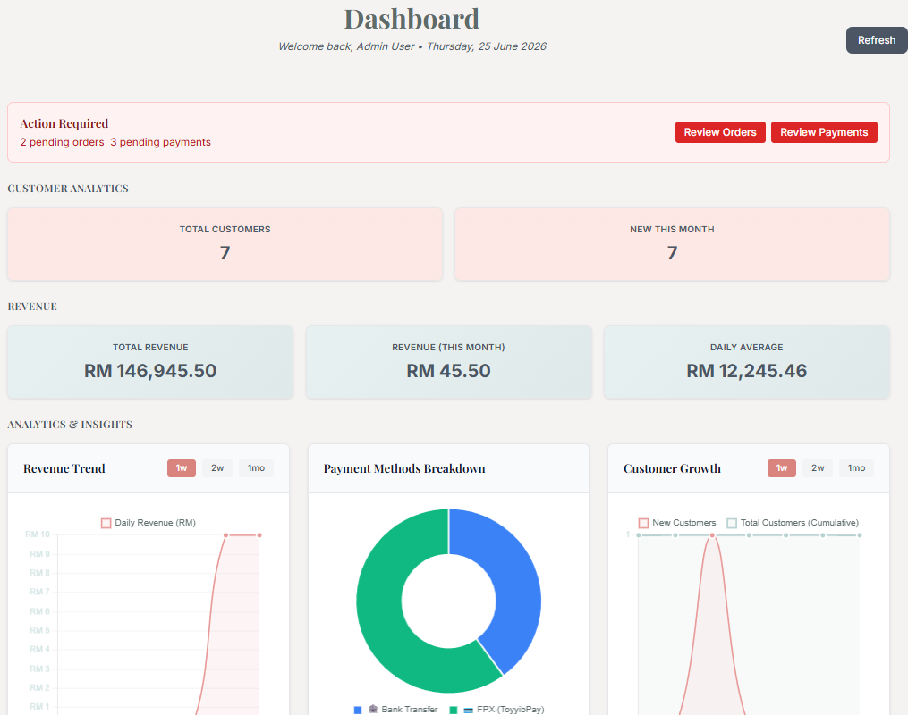
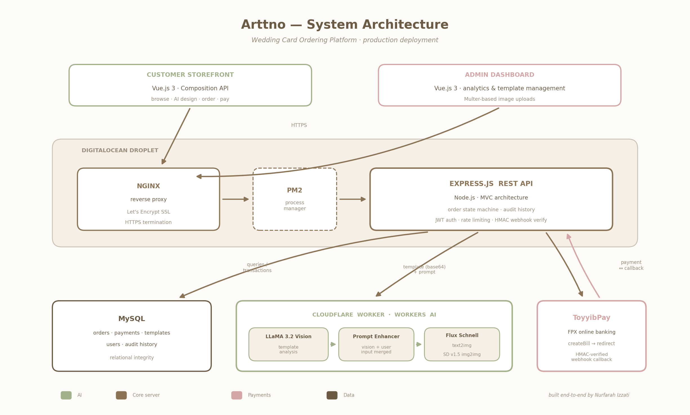

<!-- ═══════════════════ HERO ═══════════════════ -->

  

### 💍 Arttno — full-stack wedding card e-commerce with AI-powered design generation
**Live in production · Serving real customers · Built end-to-end by one engineer**

 

 

  

<!-- PLACEHOLDER 1: main demo GIF — record 10-15s of browse → customize → checkout -->

 

🔗 **[Visit the live platform](https://YOUR-LIVE-URL-HERE.com)** &nbsp;·&nbsp; 📬 [Contact me](mailto:nurfarah.dev@gmail.com)

---

## 🌿 Overview

**Arttno** is a production e-commerce platform where customers browse wedding card templates, customize designs — including **generating unique designs with AI** — place orders, and pay online. Built solo, end-to-end: database design, REST API, frontend, AI pipeline, payment integration, and deployment.

> **Note on source code** 🔒
> The source is private as this platform serves real customers and handles live payment data. I'm happy to walk through the codebase, architecture decisions, and any part of the implementation in an interview.

---

## ✨ Key Features

### 🎨 AI Design Generation Pipeline
The platform's differentiator — customers can generate unique card designs instead of only picking templates:

1. Customer describes their dream design in plain language
2. A **prompt enhancement pipeline using the Claude API** rewrites it into an optimized Stable Diffusion prompt
3. **Cloudflare Workers AI** generates the design (Stable Diffusion for image-to-image generation, **LLaMA 3.2 Vision** for image analysis)

<!-- PLACEHOLDER 2: screenshot of AI generation flow — before prompt / after result -->

### 📦 State-Machine Order Lifecycle
Orders move through a **state-machine-driven lifecycle** with a full audit history of every transition. Customers can self-service cancel within allowed states — this design eliminated a whole class of order-status disputes and reduced support overhead.

<!-- PLACEHOLDER 3: screenshot of order tracking / status page -->

### 💳 Secure Payment Integration
- **ToyyibPay** payment gateway integration
- Fraud prevention on the payment flow
- Callback security to verify payment notifications server-side before fulfilling orders

### 🖼️ Template Management System
- Admin dashboard (Vue.js 3) for managing card templates
- **Multer-based image upload** pipeline for template assets

<!-- PLACEHOLDER 4: screenshot of admin dashboard (use demo/fake data — no real customer info!) -->

---

## 🏗️ Architecture

<!-- PLACEHOLDER 5: architecture diagram — ask Claude to generate this once screenshots are done -->

**Stack rationale:**

| Layer | Technology | Why |
|-------|-----------|-----|
| Frontend | Vue.js 3 (Composition API) | Reactive customization UI, admin dashboard |
| Backend | Node.js + Express.js (MVC) | REST API, clean separation of concerns |
| Database | MySQL | Relational integrity for orders, payments & audit history |
| AI | Claude API + Cloudflare Workers AI | Prompt enhancement → Stable Diffusion + LLaMA 3.2 Vision |
| Payments | ToyyibPay | Malaysian FPX/card payments with callback verification |
| Deployment | DigitalOcean · Nginx · PM2 · Let's Encrypt | Reverse proxy, process management, free auto-renewing SSL |

---

## 🔧 Engineering Highlights

- **Order state machine** — every status transition is validated against allowed moves and recorded in an audit table, making order history fully traceable and disputes resolvable with data
- **Payment callback verification** — payment success is only trusted after server-side verification of the gateway callback, never from the client
- **AI prompt pipeline** — user input is never sent raw to the image model; Claude restructures it for quality and consistency, dramatically improving generation results
- **Zero-downtime deploys** — PM2 process management behind Nginx reverse proxy with Let's Encrypt SSL auto-renewal

---

  Built with 🤍 by <a href="https://github.com/farahyusni">Nurfarah Izzati</a> · Full-Stack Software Engineer
    
  

